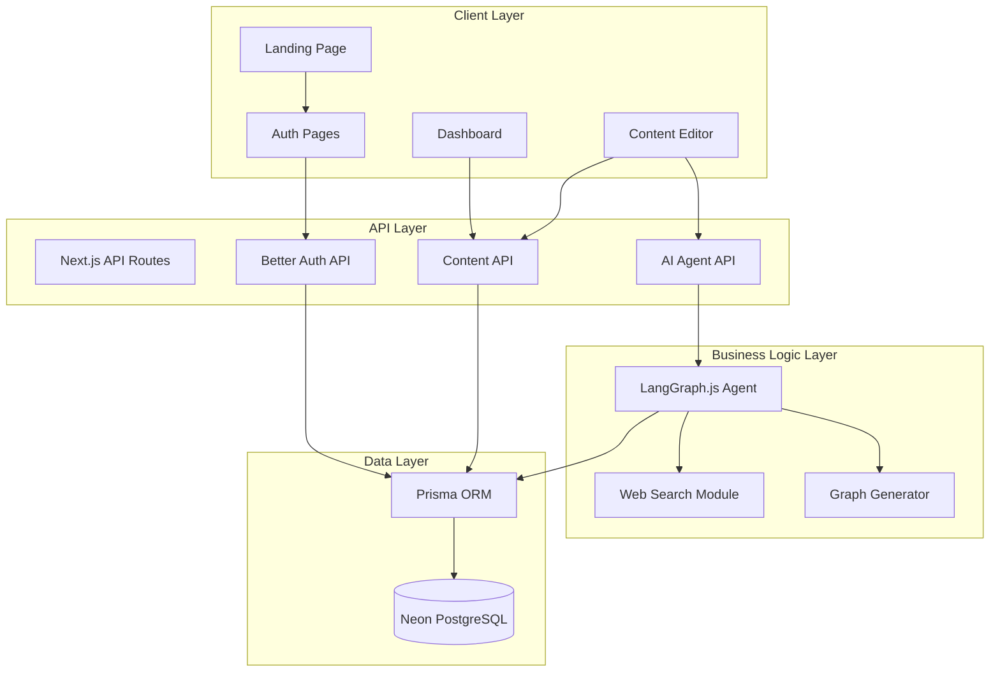
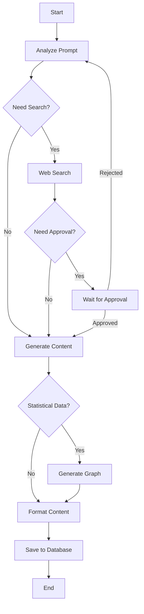

# Design Document

## Overview

The AI Content Writer is a Next.js application that combines multimodal AI capabilities with a rich content editing experience. The system architecture follows a layered approach with clear separation between the presentation layer (React components), business logic layer (AI orchestration and data management), and data persistence layer (Prisma + PostgreSQL).

The core workflow involves:
1. User authentication and session management
2. Content generation request submission
3. LangGraph.js-based AI agent orchestration with web search and human-in-the-loop capabilities
4. Real-time content streaming and display
5. Rich text editing with TipTap
6. Graph generation and editing with Recharts
7. Persistent storage of content sessions and user data

## Architecture

### High-Level Architecture



### Technology Stack

- **Frontend Framework**: Next.js 14+ (App Router)
- **Language**: TypeScript
- **Styling**: Tailwind CSS + Shadcn UI
- **Animation**: GSAP + GSAP/React
- **Authentication**: Better Auth
- **Database**: Neon PostgreSQL
- **ORM**: Prisma
- **AI Orchestration**: LangGraph.js
- **Rich Text Editor**: TipTap
- **Charts**: Recharts
- **Data Fetching**: React Query (TanStack Query)
- **Icons**: Lucide React

## Components and Interfaces

### 1. Landing Page Components

**LandingPage** (`src/components/landing/LandingPage.tsx`)
- Main container component that orchestrates all landing sections
- Manages GSAP ScrollTrigger animations

**HeroSection** (`src/components/landing/HeroSection.tsx`)
- Animated hero with headline, subheadline, and CTA
- GSAP timeline animations for text reveal and element entrance

**FeaturesSection** (`src/components/landing/FeaturesSection.tsx`)
- Grid of feature cards with icons
- Scroll-triggered fade-in animations

**TestimonialsSection** (`src/components/landing/TestimonialsSection.tsx`)
- Carousel or grid of user testimonials
- Animated on scroll

**CTASection** (`src/components/landing/CTASection.tsx`)
- Final call-to-action with sign-up button
- Animated background effects

### 2. Authentication Components

**AuthProvider** (`src/components/auth/AuthProvider.tsx`)
- Context provider for authentication state
- Wraps the application to provide auth context

**LoginForm** (`src/components/auth/LoginForm.tsx`)
- Email/password login form
- Form validation and error handling

**RegisterForm** (`src/components/auth/RegisterForm.tsx`)
- User registration form
- Password strength validation

**ProtectedRoute** (`src/components/auth/ProtectedRoute.tsx`)
- HOC or wrapper component for protected pages
- Redirects unauthenticated users

### 3. Dashboard Components

**Dashboard** (`src/app/dashboard/page.tsx`)
- Main authenticated user interface
- Lists content sessions

**ContentSessionList** (`src/components/dashboard/ContentSessionList.tsx`)
- Displays user's content sessions
- Uses React Query for data fetching

**ContentSessionCard** (`src/components/dashboard/ContentSessionCard.tsx`)
- Individual session preview card
- Shows title, preview, and metadata

**NewContentButton** (`src/components/dashboard/NewContentButton.tsx`)
- Initiates new content generation workflow

### 4. Content Editor Components

**ContentEditor** (`src/components/editor/ContentEditor.tsx`)
- Main editor container
- Integrates TipTap editor with toolbar

**EditorToolbar** (`src/components/editor/EditorToolbar.tsx`)
- Formatting controls (bold, italic, headings, etc.)
- Image insertion button
- Graph insertion button

**TipTapEditor** (`src/components/editor/TipTapEditor.tsx`)
- TipTap editor instance wrapper
- Custom extensions for images and graphs

**ImageUploader** (`src/components/editor/ImageUploader.tsx`)
- Image upload interface
- Drag-and-drop support

**GraphNode** (`src/components/editor/GraphNode.tsx`)
- Custom TipTap node for embedded graphs
- Renders Recharts components

### 5. AI Agent Components

**AgentInterface** (`src/components/agent/AgentInterface.tsx`)
- Chat-like interface for AI interaction
- Displays generation progress

**ApprovalRequestModal** (`src/components/agent/ApprovalRequestModal.tsx`)
- Modal for human-in-the-loop approvals
- Shows action details and approve/reject buttons

**StreamingContent** (`src/components/agent/StreamingContent.tsx`)
- Displays AI-generated content as it streams
- Real-time updates

### 6. Graph Components

**GraphEditor** (`src/components/graphs/GraphEditor.tsx`)
- Interface for editing graph data and styling
- Chart type selector

**ChartRenderer** (`src/components/graphs/ChartRenderer.tsx`)
- Renders Recharts components based on configuration
- Supports bar, line, pie, area charts

**DataTable** (`src/components/graphs/DataTable.tsx`)
- Editable table for graph data
- Add/remove rows and columns

### 7. API Routes

**`/api/auth/[...all]`** - Better Auth catch-all route

**`/api/agent/generate`** - POST endpoint to initiate content generation

**`/api/agent/approve`** - POST endpoint to approve/reject HITL requests

**`/api/content/sessions`** - GET/POST endpoints for content sessions

**`/api/content/sessions/[id]`** - GET/PUT/DELETE endpoints for specific session

**`/api/upload/image`** - POST endpoint for image uploads

**`/api/search/web`** - POST endpoint for web search (used by agent)

## Data Models

### Prisma Schema

```prisma
// User model
model User {
  id            String          @id @default(cuid())
  email         String          @unique
  name          String?
  passwordHash  String
  createdAt     DateTime        @default(now())
  updatedAt     DateTime        @updatedAt
  sessions      Session[]
  contentSessions ContentSession[]
}

// Better Auth session
model Session {
  id        String   @id @default(cuid())
  userId    String
  expiresAt DateTime
  user      User     @relation(fields: [userId], references: [id], onDelete: Cascade)
  createdAt DateTime @default(now())
  
  @@index([userId])
}

// Content generation session
model ContentSession {
  id          String   @id @default(cuid())
  userId      String
  title       String
  prompt      String   @db.Text
  content     String?  @db.Text
  status      SessionStatus @default(PENDING)
  metadata    Json?
  createdAt   DateTime @default(now())
  updatedAt   DateTime @updatedAt
  user        User     @relation(fields: [userId], references: [id], onDelete: Cascade)
  graphs      Graph[]
  approvalRequests ApprovalRequest[]
  
  @@index([userId])
  @@index([createdAt])
}

enum SessionStatus {
  PENDING
  GENERATING
  COMPLETED
  FAILED
}

// Graph/chart data
model Graph {
  id              String         @id @default(cuid())
  contentSessionId String
  type            ChartType
  data            Json
  config          Json
  position        Int
  createdAt       DateTime       @default(now())
  updatedAt       DateTime       @updatedAt
  contentSession  ContentSession @relation(fields: [contentSessionId], references: [id], onDelete: Cascade)
  
  @@index([contentSessionId])
}

enum ChartType {
  BAR
  LINE
  PIE
  AREA
  SCATTER
}

// Human-in-the-loop approval requests
model ApprovalRequest {
  id              String         @id @default(cuid())
  contentSessionId String
  action          String
  details         Json
  status          ApprovalStatus @default(PENDING)
  response        Json?
  createdAt       DateTime       @default(now())
  resolvedAt      DateTime?
  contentSession  ContentSession @relation(fields: [contentSessionId], references: [id], onDelete: Cascade)
  
  @@index([contentSessionId])
  @@index([status])
}

enum ApprovalStatus {
  PENDING
  APPROVED
  REJECTED
  TIMEOUT
}

// Image uploads
model Image {
  id        String   @id @default(cuid())
  userId    String
  url       String
  filename  String
  mimeType  String
  size      Int
  createdAt DateTime @default(now())
  
  @@index([userId])
}
```

### TypeScript Interfaces

```typescript
// Agent workflow state
interface AgentState {
  sessionId: string;
  prompt: string;
  messages: Message[];
  searchResults?: SearchResult[];
  pendingApproval?: ApprovalRequest;
  generatedContent: string;
  graphs: GraphData[];
  status: 'idle' | 'searching' | 'generating' | 'waiting_approval' | 'completed' | 'error';
}

// Message in agent conversation
interface Message {
  role: 'user' | 'assistant' | 'system';
  content: string;
  timestamp: Date;
}

// Web search result
interface SearchResult {
  title: string;
  url: string;
  snippet: string;
  source: string;
}

// Graph data structure
interface GraphData {
  id: string;
  type: ChartType;
  data: ChartDataPoint[];
  config: ChartConfig;
}

interface ChartDataPoint {
  [key: string]: string | number;
}

interface ChartConfig {
  title?: string;
  xAxisLabel?: string;
  yAxisLabel?: string;
  colors?: string[];
  legend?: boolean;
}

// TipTap editor content
interface EditorContent {
  type: 'doc';
  content: EditorNode[];
}

interface EditorNode {
  type: string;
  attrs?: Record<string, any>;
  content?: EditorNode[];
  text?: string;
}
```


## Correctness Properties

*A property is a characteristic or behavior that should hold true across all valid executions of a system-essentially, a formal statement about what the system should do. Properties serve as the bridge between human-readable specifications and machine-verifiable correctness guarantees.*

### Authentication Properties

**Property 1: Valid registration creates account**
*For any* valid registration credentials (email, password meeting requirements), submitting them should result in a new user account being created in the database with a unique ID.
**Validates: Requirements 2.1**

**Property 2: Valid login creates session**
*For any* existing user with valid credentials, successful login should create a session record in the database with a valid expiration time.
**Validates: Requirements 2.2**

**Property 3: Invalid credentials are rejected**
*For any* invalid credential combination (wrong password, non-existent email, malformed input), authentication attempts should be rejected with an appropriate error message.
**Validates: Requirements 2.3**

**Property 4: Authenticated access is granted**
*For any* authenticated user with a valid session, accessing protected routes should succeed and return the requested resource.
**Validates: Requirements 2.4**

**Property 5: Unauthenticated access is blocked**
*For any* request to a protected route without valid authentication, the system should redirect to the login page.
**Validates: Requirements 2.5**

### Content Session Properties

**Property 6: Prompt submission creates session**
*For any* valid content generation prompt, submitting it should create a new Content Session record with status PENDING.
**Validates: Requirements 3.1**

**Property 7: Session creation starts workflow**
*For any* newly created Content Session, the AI Agent workflow should be initiated within a reasonable time frame.
**Validates: Requirements 3.2**

**Property 8: Session persistence**
*For any* Content Session being processed, the session data should be persisted to the database and retrievable by session ID.
**Validates: Requirements 3.3**

**Property 9: Session list ordering**
*For any* user with multiple Content Sessions, retrieving the session list should return sessions ordered by creation time (newest first).
**Validates: Requirements 3.4**

**Property 10: Session loading preserves state**
*For any* Content Session, loading it by ID should return the exact content and state that was previously saved.
**Validates: Requirements 3.5**


### Web Search Properties

**Property 11: Search execution on demand**
*For any* AI Agent workflow that determines web search is needed, the Web Search Module should execute search queries and return results.
**Validates: Requirements 4.1**

**Property 12: Search results incorporation**
*For any* search results returned by the Web Search Module, the generated content should include information from those results.
**Validates: Requirements 4.2**

**Property 13: Search error handling**
*For any* web search failure (network error, API error, timeout), the system should handle the error gracefully without crashing the workflow.
**Validates: Requirements 4.3**

**Property 14: Source citation**
*For any* search results used in content generation, the generated content should include citations with source URLs.
**Validates: Requirements 4.4**

### Human-in-the-Loop Properties

**Property 15: Approval request creation pauses workflow**
*For any* action requiring user approval, the system should create an Approval Request record and pause workflow execution until resolved.
**Validates: Requirements 5.1**

**Property 16: Approval request contains details**
*For any* Approval Request, it should contain the action description, relevant details, and approval/rejection options.
**Validates: Requirements 5.2**

**Property 17: Approval resumes workflow**
*For any* approved Approval Request, the AI Agent workflow should resume execution with the approved action.
**Validates: Requirements 5.3**

**Property 18: Rejection skips action**
*For any* rejected Approval Request, the AI Agent workflow should skip the rejected action and continue with alternative paths.
**Validates: Requirements 5.4**

**Property 19: Timeout handling**
*For any* Approval Request that exceeds the configured timeout period, the system should handle it according to the timeout policy (default reject or default approve).
**Validates: Requirements 5.5**

### Graph Generation Properties

**Property 20: Statistical data generates charts**
*For any* statistical data identified by the AI Agent, the Graph Generator should create an appropriate chart visualization.
**Validates: Requirements 6.1**

**Property 21: Graph embedding in content**
*For any* generated graph, it should be embedded in the content structure at the appropriate position.
**Validates: Requirements 6.2**

**Property 22: Graph editability**
*For any* generated graph, users should be able to modify the chart type, data values, and styling options.
**Validates: Requirements 6.3**

**Property 23: Graph modification persistence**
*For any* graph modification, saving the changes should persist them to the database, and reloading should show the modified graph.
**Validates: Requirements 6.4**


### Rich Text Editor Properties

**Property 24: Content display in editor**
*For any* generated content, it should be displayed in the TipTap Rich Text Editor with proper formatting.
**Validates: Requirements 7.1**

**Property 25: Real-time content updates**
*For any* text modification in the Rich Text Editor, the content state should update immediately without delay.
**Validates: Requirements 7.2**

**Property 26: Content save and load round-trip**
*For any* content with formatting (bold, italic, headings, lists), saving and then loading should preserve all formatting exactly.
**Validates: Requirements 7.4, 7.5**

### Image Handling Properties

**Property 27: Image upload returns URL**
*For any* valid image file uploaded, the system should store it and return a valid, accessible URL.
**Validates: Requirements 8.2**

**Property 28: Image URL embedding**
*For any* valid image URL provided to the Rich Text Editor, it should be embedded at the current cursor position.
**Validates: Requirements 8.3**

**Property 29: Image manipulation**
*For any* embedded image, users should be able to reposition and resize it within the editor.
**Validates: Requirements 8.4**

**Property 30: Image reference persistence**
*For any* content containing embedded images, saving and reloading should preserve all image references and positions.
**Validates: Requirements 8.5**

### Data Management Properties

**Property 31: Cache invalidation on mutation**
*For any* successful data mutation (create, update, delete), React Query should invalidate the relevant query caches, causing data to be refetched.
**Validates: Requirements 9.3**

**Property 32: Request retry on failure**
*For any* failed network request, React Query should retry according to the configured retry policy before failing permanently.
**Validates: Requirements 9.4**

**Property 33: Cached data serving**
*For any* cached query data, React Query should serve the cached data immediately while revalidating in the background.
**Validates: Requirements 9.5**

### Error Handling Properties

**Property 34: Error boundary catches errors**
*For any* runtime error in React components, error boundaries should catch the error, log it, and display a fallback UI.
**Validates: Requirements 10.4**

### Database Properties

**Property 35: Query error handling**
*For any* database query that fails (connection error, constraint violation, timeout), the system should handle the error gracefully and return a meaningful error message.
**Validates: Requirements 11.4**

### Multimodal Input Properties

**Property 36: Multimodal input processing**
*For any* combination of supported input types (text, images), the AI Agent should process all provided modalities.
**Validates: Requirements 12.1**

**Property 37: Multimodal output incorporation**
*For any* multimodal input provided, the generated content should incorporate elements from all input modalities.
**Validates: Requirements 12.3**

**Property 38: Unsupported media rejection**
*For any* unsupported media type provided as input, the system should reject it with a clear error message indicating the unsupported type.
**Validates: Requirements 12.4**


## Error Handling

### Error Categories

1. **Authentication Errors**
   - Invalid credentials
   - Expired sessions
   - Missing permissions
   - Strategy: Return 401/403 with clear error messages, redirect to login

2. **Validation Errors**
   - Invalid input format
   - Missing required fields
   - Constraint violations
   - Strategy: Return 400 with field-specific error messages

3. **AI Agent Errors**
   - LLM API failures
   - Timeout errors
   - Rate limiting
   - Strategy: Retry with exponential backoff, fallback to cached responses, notify user

4. **Database Errors**
   - Connection failures
   - Query timeouts
   - Constraint violations
   - Strategy: Retry transient errors, log persistent errors, return user-friendly messages

5. **External Service Errors**
   - Web search API failures
   - Image upload service errors
   - Strategy: Graceful degradation, cache when possible, inform user of limitations

### Error Handling Patterns

**React Error Boundaries**
```typescript
// Global error boundary for unexpected errors
<ErrorBoundary fallback={<ErrorFallback />}>
  <App />
</ErrorBoundary>

// Route-specific error boundaries
<ErrorBoundary fallback={<EditorErrorFallback />}>
  <ContentEditor />
</ErrorBoundary>
```

**API Error Responses**
```typescript
// Standardized error response format
interface ErrorResponse {
  error: {
    code: string;
    message: string;
    details?: Record<string, any>;
  };
}
```

**React Query Error Handling**
```typescript
// Automatic retry for transient errors
const query = useQuery({
  queryKey: ['sessions'],
  queryFn: fetchSessions,
  retry: 3,
  retryDelay: (attemptIndex) => Math.min(1000 * 2 ** attemptIndex, 30000),
});

// Error state handling in components
if (query.error) {
  return <ErrorMessage error={query.error} />;
}
```


## Testing Strategy

### Dual Testing Approach

The application will use both unit testing and property-based testing to ensure comprehensive coverage:

- **Unit tests** verify specific examples, edge cases, and integration points
- **Property-based tests** verify universal properties that should hold across all inputs
- Together they provide complete coverage: unit tests catch concrete bugs, property tests verify general correctness

### Property-Based Testing

**Framework**: We will use **fast-check** for property-based testing in TypeScript/JavaScript.

**Configuration**: Each property-based test will run a minimum of 100 iterations to ensure thorough coverage of the input space.

**Test Tagging**: Each property-based test will include a comment explicitly referencing the correctness property from this design document using the format:
```typescript
// Feature: ai-content-writer, Property 1: Valid registration creates account
```

**Implementation**: Each correctness property will be implemented by a SINGLE property-based test that validates the property across randomly generated inputs.

### Unit Testing

**Framework**: Vitest for unit tests, React Testing Library for component tests

**Coverage Areas**:
- Component rendering and user interactions
- API route handlers
- Utility functions and helpers
- Integration between components
- Specific edge cases (empty inputs, boundary values, error conditions)

### Test Organization

```
src/
  __tests__/
    unit/
      components/
      api/
      utils/
    properties/
      auth.properties.test.ts
      content-session.properties.test.ts
      editor.properties.test.ts
      graphs.properties.test.ts
```

### Example Property-Based Test

```typescript
import fc from 'fast-check';
import { describe, it, expect } from 'vitest';

// Feature: ai-content-writer, Property 1: Valid registration creates account
describe('Authentication Properties', () => {
  it('should create account for any valid registration credentials', async () => {
    await fc.assert(
      fc.asyncProperty(
        fc.emailAddress(),
        fc.string({ minLength: 8, maxLength: 100 }),
        async (email, password) => {
          const result = await registerUser({ email, password });
          expect(result.user).toBeDefined();
          expect(result.user.id).toBeTruthy();
          expect(result.user.email).toBe(email);
        }
      ),
      { numRuns: 100 }
    );
  });
});
```

### Integration Testing

- Test complete user workflows (registration → login → content creation → editing)
- Test AI agent workflow orchestration end-to-end
- Test database operations with test database
- Test API routes with supertest

### E2E Testing (Optional)

- Playwright for critical user journeys
- Test landing page → sign up → create content → edit → save workflow
- Test human-in-the-loop approval flow


## LangGraph.js Agent Workflow

### Workflow Architecture

The AI Agent uses LangGraph.js to orchestrate a stateful workflow with multiple nodes:



### Workflow Nodes

1. **Analyze Prompt Node**
   - Parses user prompt
   - Determines content type and requirements
   - Identifies if web search is needed

2. **Web Search Node**
   - Executes search queries
   - Retrieves and filters results
   - Extracts relevant information

3. **Approval Node**
   - Creates approval request
   - Pauses workflow execution
   - Waits for user response

4. **Generate Content Node**
   - Calls LLM API with context
   - Streams generated content
   - Handles multimodal inputs

5. **Graph Generation Node**
   - Identifies statistical data
   - Determines appropriate chart type
   - Creates graph configuration

6. **Format Content Node**
   - Structures content for TipTap
   - Embeds graphs and images
   - Applies formatting

7. **Save Node**
   - Persists content to database
   - Updates session status
   - Triggers cache invalidation

### State Management

```typescript
interface WorkflowState {
  sessionId: string;
  prompt: string;
  userInputs: MultimodalInput[];
  searchResults: SearchResult[];
  approvalRequests: ApprovalRequest[];
  generatedContent: string;
  graphs: GraphData[];
  status: WorkflowStatus;
  error?: Error;
}
```

### Streaming Implementation

The agent streams content generation in real-time using Server-Sent Events (SSE):

```typescript
// API route for streaming
export async function POST(req: Request) {
  const encoder = new TextEncoder();
  const stream = new ReadableStream({
    async start(controller) {
      // Stream content as it's generated
      for await (const chunk of agentWorkflow.stream(state)) {
        controller.enqueue(encoder.encode(`data: ${JSON.stringify(chunk)}\n\n`));
      }
      controller.close();
    },
  });
  
  return new Response(stream, {
    headers: {
      'Content-Type': 'text/event-stream',
      'Cache-Control': 'no-cache',
      'Connection': 'keep-alive',
    },
  });
}
```


## Security Considerations

### Authentication Security

- Passwords hashed with bcrypt (minimum 10 rounds)
- Session tokens stored as httpOnly cookies
- CSRF protection enabled
- Rate limiting on auth endpoints (5 attempts per 15 minutes)

### API Security

- All API routes require authentication (except public landing page)
- Input validation on all endpoints using Zod schemas
- SQL injection prevention through Prisma parameterized queries
- XSS prevention through React's built-in escaping

### File Upload Security

- File type validation (only allow images: jpg, png, gif, webp)
- File size limits (max 10MB per image)
- Virus scanning for uploaded files (optional with ClamAV)
- Secure file storage with signed URLs

### Environment Variables

Required environment variables:
```
DATABASE_URL=postgresql://...
BETTER_AUTH_SECRET=...
BETTER_AUTH_URL=http://localhost:3000
OPENAI_API_KEY=...
SEARCH_API_KEY=...
UPLOAD_BUCKET_URL=...
```

## Performance Optimization

### Database Optimization

- Indexed columns: userId, createdAt, status
- Connection pooling with Prisma
- Query optimization with select statements
- Pagination for large result sets

### Caching Strategy

- React Query caching for API responses
- Stale-while-revalidate pattern
- Cache invalidation on mutations
- CDN caching for static assets

### Code Splitting

- Route-based code splitting with Next.js
- Dynamic imports for heavy components (TipTap, Recharts)
- Lazy loading for landing page sections

### Image Optimization

- Next.js Image component for automatic optimization
- WebP format with fallbacks
- Responsive images with srcset
- Lazy loading below the fold

## Deployment Considerations

### Infrastructure

- **Hosting**: Vercel (recommended) or similar Next.js-optimized platform
- **Database**: Neon PostgreSQL (serverless)
- **File Storage**: Vercel Blob or AWS S3
- **CDN**: Automatic with Vercel

### Environment Setup

1. Development: Local PostgreSQL or Neon branch
2. Staging: Separate Neon database
3. Production: Production Neon database with backups

### Monitoring

- Error tracking with Sentry
- Performance monitoring with Vercel Analytics
- Database query monitoring with Prisma Studio
- User analytics (optional)

### CI/CD Pipeline

1. Run linting and type checking
2. Run unit tests and property-based tests
3. Build Next.js application
4. Run database migrations
5. Deploy to Vercel
6. Run smoke tests

