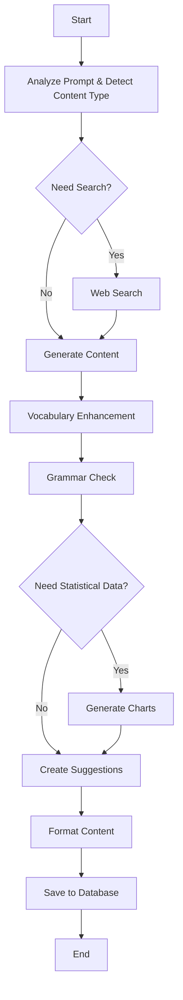

# Design Document

## Overview

The Enhanced AI Workflow is a sophisticated content generation system that removes the approval workflow bottleneck and adds intelligent content improvement capabilities. The system uses LangGraph.js to orchestrate a streamlined workflow that generates content, creates context-aware suggestions, enhances vocabulary, checks grammar, and automatically generates statistical visualizations when appropriate.

The workflow is designed to support multiple writing types (technical, reports, blogs, stories, academic) and provides tailored suggestions for each. All images and charts are stored inline within the content structure, eliminating the need for separate database tables and preventing orphaned resources.

## Architecture

### Enhanced Workflow Architecture



### Key Differences from Original Workflow

1. **No Approval Node**: The workflow executes continuously without pausing for user approval
2. **Vocabulary Enhancement Node**: New node that analyzes and improves word choices
3. **Grammar Check Node**: New node that identifies and suggests grammar corrections
4. **Suggestions Node**: New node that creates context-aware suggestions with location tracking
5. **Inline Storage**: Images and charts are stored directly in content JSON, not separate tables
6. **Content Type Detection**: Workflow detects and adapts to different writing types

## Components and Interfaces

### 1. Workflow Nodes

**AnalyzePromptNode** (`src/lib/agent/nodes/analyze-prompt-enhanced.ts`)
- Parses user prompt and multimodal inputs
- Detects content type (technical, report, blog, story, academic, business)
- Determines if web search is needed
- Sets content type context for downstream nodes

**WebSearchNode** (`src/lib/agent/nodes/web-search.ts`)
- Executes automatically without approval
- Retrieves and filters search results
- Extracts relevant information with citations

**GenerateContentNode** (`src/lib/agent/nodes/generate-content-enhanced.ts`)
- Calls LLM API with content type context
- Generates content appropriate for the detected type
- Incorporates search results with inline citations
- Streams content in real-time

**VocabularyEnhancementNode** (`src/lib/agent/nodes/vocabulary-enhancement.ts`)
- Analyzes word choices in generated content
- Identifies weak, repetitive, or inappropriate words
- Suggests stronger alternatives with definitions
- Tailors suggestions to content type

**GrammarCheckNode** (`src/lib/agent/nodes/grammar-check.ts`)
- Identifies grammatical errors, typos, and style issues
- Provides error type, explanation, and correction
- Applies style rules appropriate for content type
- Generates inline correction suggestions

**StatisticalDataNode** (`src/lib/agent/nodes/statistical-data.ts`)
- Analyzes content to determine if data visualization would help
- Generates appropriate data points based on context
- Selects optimal chart type (bar, line, pie, area, scatter)
- Formats data in TipTap-compatible format

**SuggestionsNode** (`src/lib/agent/nodes/suggestions.ts`)
- Creates context-aware suggestions based on content and prompt
- Includes precise location information (paragraph index, heading context)
- Generates preview of surrounding content
- Orders suggestions by relevance and document position

**FormatContentNode** (`src/lib/agent/nodes/format-content-enhanced.ts`)
- Structures content for TipTap JSON format
- Embeds charts inline with type, data, and config
- Embeds images inline with URLs
- Applies formatting and structure

**SaveNode** (`src/lib/agent/nodes/save-enhanced.ts`)
- Persists content with inline images and charts
- Saves suggestions, vocabulary improvements, and grammar corrections
- Updates session status
- Triggers cache invalidation

### 2. Data Structures

**Enhanced Workflow State**
```typescript
interface EnhancedWorkflowState {
  sessionId: string;
  prompt: string;
  contentType: ContentType;
  userInputs: MultimodalInput[];
  needsSearch: boolean;
  searchResults: SearchResult[];
  generatedContent: string;
  vocabularySuggestions: VocabularySuggestion[];
  grammarIssues: GrammarIssue[];
  charts: ChartData[];
  suggestions: ContextualSuggestion[];
  formattedContent: TipTapContent;
  status: WorkflowStatus;
  error?: Error;
  metadata: WorkflowMetadata;
}

type ContentType = 'technical' | 'report' | 'blog' | 'story' | 'academic' | 'business';

interface VocabularySuggestion {
  id: string;
  originalWord: string;
  suggestedWord: string;
  definition: string;
  usageNote: string;
  location: ContentLocation;
  relevanceScore: number;
}

interface GrammarIssue {
  id: string;
  type: 'grammar' | 'spelling' | 'style' | 'punctuation';
  problematicText: string;
  explanation: string;
  correction: string;
  location: ContentLocation;
  severity: 'error' | 'warning' | 'suggestion';
}

interface ChartData {
  id: string;
  type: ChartType;
  data: ChartDataPoint[];
  config: ChartConfig;
  location: ContentLocation;
}

interface ContextualSuggestion {
  id: string;
  text: string;
  type: 'addition' | 'expansion' | 'clarification' | 'example';
  location: ContentLocation;
  contextPreview: string;
  relevanceScore: number;
}

interface ContentLocation {
  paragraphIndex?: number;
  headingContext?: string;
  characterOffset?: number;
  nodeId?: string;
}
```

**TipTap Chart Node Format**
```typescript
// This matches the existing GraphNode extension
interface TipTapChartNode {
  type: 'graph';
  attrs: {
    id: string;
    type: ChartType; // 'bar' | 'line' | 'pie' | 'area' | 'scatter'
    data: ChartDataPoint[]; // Array of {[key: string]: string | number}
    config: ChartConfig; // {title?, xAxisLabel?, yAxisLabel?, colors?, legend?, dataKey?, xKey?, yKey?}
  };
}
```

### 3. UI Components

**SuggestionsPanel** (`src/components/editor/SuggestionsPanel.tsx`)
- Displays context-aware suggestions in a side panel
- Shows location context and preview
- Allows one-click application of suggestions
- Highlights corresponding location on hover

**VocabularyPanel** (`src/components/editor/VocabularyPanel.tsx`)
- Lists vocabulary enhancement suggestions
- Shows definitions and usage notes
- Allows word replacement with formatting preservation

**GrammarPanel** (`src/components/editor/GrammarPanel.tsx`)
- Displays grammar issues with severity indicators
- Shows explanations and corrections
- Highlights problematic text in editor
- Allows one-click correction application

**ContentTypeSelector** (`src/components/editor/ContentTypeSelector.tsx`)
- Allows manual content type selection
- Shows detected content type
- Updates workflow context when changed

## Data Models

### Database Schema Changes

**Remove Separate Tables**
- Remove `Graph` table (charts stored inline in content)
- Remove `Image` table (images stored inline in content)
- Remove `ApprovalRequest` table (no approval workflow)

**Update ContentSession Model**
```prisma
model ContentSession {
  id          String   @id @default(cuid())
  userId      String
  title       String
  prompt      String   @db.Text
  content     Json?    // TipTap JSON with inline images and charts
  contentType ContentType @default(GENERAL)
  suggestions Json?    // Array of ContextualSuggestion
  vocabularySuggestions Json? // Array of VocabularySuggestion
  grammarIssues Json?  // Array of GrammarIssue
  status      SessionStatus @default(PENDING)
  metadata    Json?
  createdAt   DateTime @default(now())
  updatedAt   DateTime @updatedAt
  user        User     @relation(fields: [userId], references: [id], onDelete: Cascade)
  
  @@index([userId])
  @@index([createdAt])
  @@index([contentType])
}

enum ContentType {
  TECHNICAL
  REPORT
  BLOG
  STORY
  ACADEMIC
  BUSINESS
  GENERAL
}
```

## Correctness Properties

*A property is a characteristic or behavior that should hold true across all valid executions of a system-essentially, a formal statement about what the system should do. Properties serve as the bridge between human-readable specifications and machine-verifiable correctness guarantees.*

### Suggestion System Properties

**Property 1: Suggestions are always created**
*For any* content generation workflow, the system should create at least one context-aware suggestion based on the prompt and generated content.
**Validates: Requirements 1.1**

**Property 2: Suggestions include location**
*For any* created suggestion, it should include location information (paragraph index or heading context).
**Validates: Requirements 1.2**

**Property 3: Suggestion application preserves content**
*For any* suggestion applied to content, the surrounding content structure and formatting should remain unchanged.
**Validates: Requirements 1.3**

**Property 4: Suggestion display includes required fields**
*For any* displayed suggestion, it should include suggestion text, location context, and application preview.
**Validates: Requirements 1.4**

**Property 5: Suggestions are ordered correctly**
*For any* set of multiple suggestions, they should be ordered by relevance score and document position.
**Validates: Requirements 1.5**

### Vocabulary Enhancement Properties

**Property 6: Vocabulary analysis identifies opportunities**
*For any* generated content, the vocabulary enhancer should analyze word choices and identify at least one improvement opportunity if weak words exist.
**Validates: Requirements 2.1**

**Property 7: Weak words get alternatives**
*For any* detected weak or repetitive word, the vocabulary enhancer should suggest at least one stronger alternative with context.
**Validates: Requirements 2.2**

**Property 8: Vocabulary matches content type**
*For any* content type, vocabulary suggestions should use terminology appropriate for that type (technical terms for technical content, formal language for reports, etc.).
**Validates: Requirements 2.3**

**Property 9: Vocabulary replacement preserves formatting**
*For any* vocabulary suggestion applied, the surrounding formatting (bold, italic, links) should be preserved.
**Validates: Requirements 2.4**

**Property 10: Vocabulary suggestions include definitions**
*For any* vocabulary suggestion, it should include a definition or usage note.
**Validates: Requirements 2.5**

### Grammar Checking Properties

**Property 11: Grammar errors are identified**
*For any* content containing grammatical errors, the grammar checker should identify them.
**Validates: Requirements 3.1**

**Property 12: Grammar issues include complete information**
*For any* detected grammar issue, it should include error type, explanation, and suggested correction.
**Validates: Requirements 3.2**

**Property 13: Grammar highlighting works**
*For any* grammar issue displayed, the system should call the highlight function with the correct text position.
**Validates: Requirements 3.3**

**Property 14: Grammar corrections replace text**
*For any* grammar correction applied, the incorrect text should be replaced with the correction.
**Validates: Requirements 3.4**

**Property 15: Grammar supports multiple styles**
*For any* writing style (formal, casual, technical, creative), the grammar checker should apply appropriate rules.
**Validates: Requirements 3.5**

### Statistical Data Properties

**Property 16: Statistical data determination**
*For any* content analyzed, the statistical data node should return a boolean decision about whether data visualization would enhance the content.
**Validates: Requirements 4.1**

**Property 17: Data generation is contextual**
*For any* content requiring statistical data, the generated data points should be contextually relevant to the content topic.
**Validates: Requirements 4.2**

**Property 18: Chart type selection is valid**
*For any* generated chart, the selected type should be one of the supported values (bar, line, pie, area, scatter).
**Validates: Requirements 4.3**

**Property 19: Chart format matches TipTap**
*For any* created chart, it should have the structure {id, type, data, config} matching the TipTap GraphNode format.
**Validates: Requirements 4.4**

**Property 20: Charts are embedded at correct location**
*For any* chart generated, it should be inserted at an appropriate location in the content structure based on context.
**Validates: Requirements 4.5**

### Inline Storage Properties

**Property 21: Images stored inline**
*For any* image inserted, the image URL should be stored directly in the content JSON structure, not in a separate table.
**Validates: Requirements 5.1**

**Property 22: Charts stored inline**
*For any* chart created, the chart data, type, and config should be stored directly in the content JSON structure, not in a separate table.
**Validates: Requirements 5.2**

**Property 23: Content round-trip preserves inline elements**
*For any* content with inline images and charts, saving and then loading should preserve all images and charts exactly.
**Validates: Requirements 5.3, 5.4**

**Property 24: No orphaned records**
*For any* content deletion, there should be no orphaned image or chart records in separate database tables.
**Validates: Requirements 5.5**

### Streamlined Workflow Properties

**Property 25: No approval requests created**
*For any* workflow execution, no approval request records should be created in the database.
**Validates: Requirements 6.1**

**Property 26: Search executes automatically**
*For any* workflow that needs web search, the search should execute without pausing or creating approval requests.
**Validates: Requirements 6.2**

**Property 27: Workflow executes all nodes**
*For any* workflow execution, all required nodes should execute without interruption (analyze, generate, vocab, grammar, suggestions, format, save).
**Validates: Requirements 6.3**

**Property 28: Complete response provided**
*For any* completed workflow, the response should contain generated content, suggestions, vocabulary improvements, and grammar corrections.
**Validates: Requirements 6.4**

**Property 29: Graceful error handling**
*For any* error occurring during workflow execution, the workflow should handle it gracefully and continue with available data.
**Validates: Requirements 6.5**

### Content Type Awareness Properties

**Property 30: Content type detection**
*For any* content analyzed, the workflow should detect and assign a content type (technical, report, blog, story, academic, business, or general).
**Validates: Requirements 7.1**

**Property 31: Suggestions match content type**
*For any* content type, the generated suggestions should be appropriate for that type.
**Validates: Requirements 7.2**

**Property 32: Vocabulary matches content type**
*For any* content type, vocabulary enhancements should use appropriate terminology.
**Validates: Requirements 7.3**

**Property 33: Grammar rules match content type**
*For any* content type, grammar checking should apply appropriate style rules.
**Validates: Requirements 7.4**

**Property 34: Visualizations match content type**
*For any* content type, generated statistical visualizations should be appropriate for that type.
**Validates: Requirements 7.5**

### Chart Format Properties

**Property 35: Chart data uses correct interface**
*For any* generated chart data, it should conform to the ChartDataPoint interface with string/number key-value pairs.
**Validates: Requirements 8.1**

**Property 36: Chart config uses correct interface**
*For any* chart configuration, it should conform to the ChartConfig interface with title, axis labels, colors, and legend settings.
**Validates: Requirements 8.2**

**Property 37: Chart type is valid**
*For any* chart, the type should be one of the supported ChartType values.
**Validates: Requirements 8.3**

**Property 38: Chart node has required attributes**
*For any* chart embedded in content, the TipTap node should have id, type, data, and config attributes.
**Validates: Requirements 8.4**

**Property 39: Charts render correctly**
*For any* chart in content, the TipTap GraphNode extension should render it without errors.
**Validates: Requirements 8.5**

### Location Tracking Properties

**Property 40: Suggestions include location context**
*For any* suggestion, it should include paragraph index or heading context.
**Validates: Requirements 9.1**

**Property 41: Suggestions show content preview**
*For any* displayed suggestion, it should include a preview of surrounding content.
**Validates: Requirements 9.2**

**Property 42: Hover highlights location**
*For any* suggestion hovered, the system should call the highlight function for the corresponding editor location.
**Validates: Requirements 9.3**

**Property 43: Application scrolls to location**
*For any* suggestion applied, the system should scroll to and focus the insertion point.
**Validates: Requirements 9.4**

**Property 44: Outdated suggestions are marked**
*For any* suggestion that is no longer applicable, it should be marked as outdated or removed.
**Validates: Requirements 9.5**

### Writing Type Support Properties

**Property 45: Technical writing support**
*For any* technical documentation content, suggestions should include technical terminology, code examples, and structured formatting.
**Validates: Requirements 10.1**

**Property 46: Report writing support**
*For any* report content, suggestions should include data visualizations, executive summaries, and formal language.
**Validates: Requirements 10.2**

**Property 47: Blog writing support**
*For any* blog post content, suggestions should include engaging headlines, conversational tone, and SEO improvements.
**Validates: Requirements 10.3**

**Property 48: Story writing support**
*For any* story content, suggestions should include narrative improvements, character development, and descriptive language.
**Validates: Requirements 10.4**

**Property 49: Academic writing support**
*For any* academic content, suggestions should include citations, formal structure, and scholarly vocabulary.
**Validates: Requirements 10.5**

## Error Handling

### Error Categories

1. **LLM API Errors**
   - Rate limiting
   - Timeout errors
   - Invalid responses
   - Strategy: Retry with exponential backoff, fallback to simpler prompts, continue workflow with partial results

2. **Search Errors**
   - API failures
   - Network timeouts
   - Invalid queries
   - Strategy: Continue workflow without search results, log error, notify in metadata

3. **Content Analysis Errors**
   - Parsing failures
   - Invalid content structure
   - Strategy: Use fallback analysis, continue with best-effort results

4. **Database Errors**
   - Connection failures
   - Save timeouts
   - Strategy: Retry transient errors, cache results temporarily, notify user

### Graceful Degradation

The workflow is designed to continue even when individual nodes encounter errors:

- If vocabulary enhancement fails, continue with grammar checking
- If grammar checking fails, continue with suggestions
- If statistical data generation fails, continue without charts
- If suggestions fail, still save the generated content

## Testing Strategy

### Dual Testing Approach

- **Unit tests** verify specific examples, edge cases, and integration points
- **Property-based tests** verify universal properties across all inputs
- Both types complement each other for comprehensive coverage

### Property-Based Testing

**Framework**: fast-check for TypeScript/JavaScript

**Configuration**: Each property-based test runs a minimum of 100 iterations

**Test Tagging**: Each test includes a comment with format:
```typescript
// Feature: enhanced-ai-workflow, Property {number}: {property_text}
```

**Implementation**: Each correctness property is implemented by a SINGLE property-based test

### Unit Testing

**Framework**: Vitest with React Testing Library

**Coverage Areas**:
- Workflow node execution
- Suggestion application logic
- Vocabulary and grammar checking
- Chart generation and formatting
- Content type detection
- UI component rendering

### Test Organization

```
src/
  __tests__/
    unit/
      nodes/
        vocabulary-enhancement.test.ts
        grammar-check.test.ts
        suggestions.test.ts
        statistical-data.test.ts
      components/
        SuggestionsPanel.test.ts
        VocabularyPanel.test.ts
        GrammarPanel.test.ts
    properties/
      enhanced-workflow.properties.test.ts
      suggestions.properties.test.ts
      vocabulary.properties.test.ts
      grammar.properties.test.ts
      charts.properties.test.ts
```

## Performance Considerations

### Workflow Optimization

- Parallel execution of independent nodes (vocabulary + grammar can run in parallel)
- Streaming content generation for real-time feedback
- Debounced suggestion updates
- Lazy loading of suggestion panels

### Caching Strategy

- Cache content type detection results
- Cache vocabulary and grammar analysis for unchanged content
- React Query caching for session data
- Memoize chart rendering

### Resource Management

- Limit number of suggestions generated (max 10-15)
- Limit vocabulary suggestions per paragraph (max 3-5)
- Batch grammar checks for efficiency
- Throttle real-time analysis during editing

## Migration from Original Workflow

### Database Migration

1. Add `contentType` field to ContentSession
2. Add `suggestions`, `vocabularySuggestions`, `grammarIssues` JSON fields
3. Migrate existing Graph records to inline format in content JSON
4. Migrate existing Image records to inline format in content JSON
5. Drop Graph, Image, and ApprovalRequest tables

### Workflow Migration

1. Deploy new workflow nodes alongside existing ones
2. Feature flag to switch between old and new workflows
3. Gradual rollout to users
4. Monitor performance and error rates
5. Complete migration after validation

### Content Migration Script

```typescript
async function migrateContentToInlineFormat(sessionId: string) {
  const session = await prisma.contentSession.findUnique({
    where: { id: sessionId },
    include: { graphs: true }
  });
  
  // Parse existing content
  const content = JSON.parse(session.content);
  
  // Convert graphs to inline format
  for (const graph of session.graphs) {
    const chartNode = {
      type: 'graph',
      attrs: {
        id: graph.id,
        type: graph.type.toLowerCase(),
        data: graph.data,
        config: graph.config
      }
    };
    
    // Insert at appropriate position
    content.content.splice(graph.position, 0, chartNode);
  }
  
  // Update session with inline content
  await prisma.contentSession.update({
    where: { id: sessionId },
    data: {
      content: JSON.stringify(content)
    }
  });
  
  // Delete old graph records
  await prisma.graph.deleteMany({
    where: { contentSessionId: sessionId }
  });
}
```

## Security Considerations

### Input Validation

- Validate content type enum values
- Sanitize suggestion text before display
- Validate chart data structure
- Limit suggestion text length

### Content Safety

- Filter inappropriate vocabulary suggestions
- Validate grammar corrections don't introduce vulnerabilities
- Sanitize user-provided content before analysis
- Rate limit workflow executions per user

### Data Privacy

- Don't log sensitive content to external services
- Encrypt content at rest
- Secure API keys for LLM and search services
- Implement user data deletion compliance

## Future Enhancements

### Potential Additions

1. **Collaborative Suggestions**: Allow multiple users to suggest improvements
2. **Learning from Feedback**: Track which suggestions users accept/reject
3. **Custom Vocabulary Lists**: User-defined terminology preferences
4. **Style Guides**: Configurable style rules per organization
5. **Version History**: Track content changes and suggestion applications
6. **Export Options**: Export with or without suggestions
7. **Suggestion Templates**: Pre-defined suggestion patterns for common scenarios
8. **Real-time Collaboration**: Multiple users editing with shared suggestions
