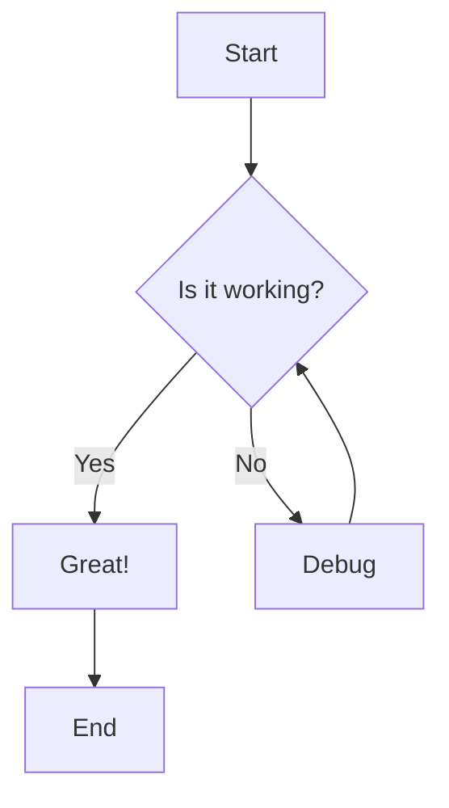
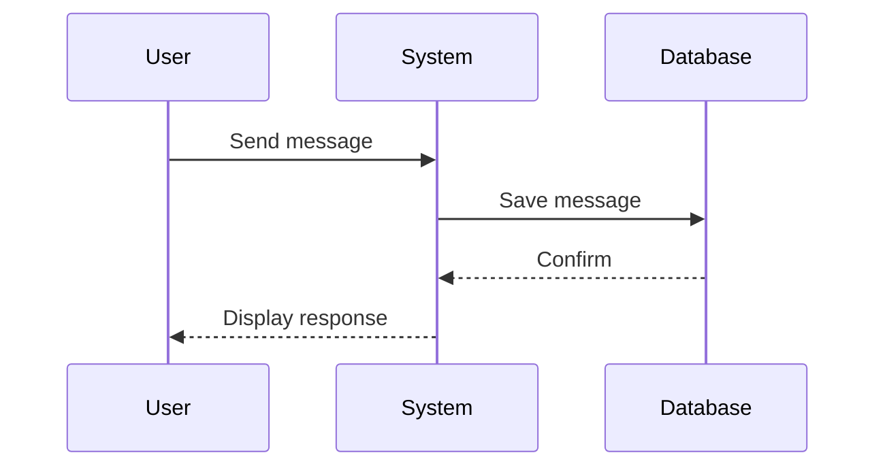
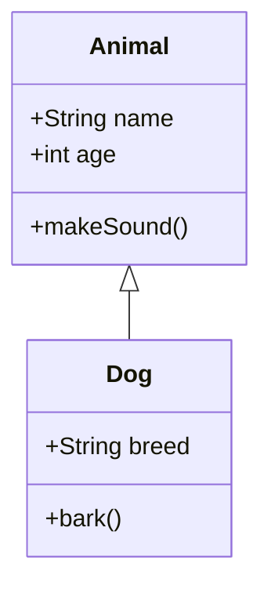
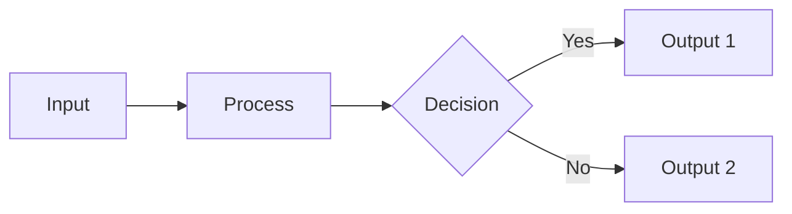

# Math and Mermaid Rendering Test

This document contains examples to test math and Mermaid diagram rendering in the chat interface.

## Math Rendering Examples

### Inline Math
Copy and paste this into the chat:

```
The famous equation $E = mc^2$ shows the relationship between energy and mass.
```

### Block Math
Copy and paste this into the chat:

```
The quadratic formula is:

$$
x = \frac{-b \pm \sqrt{b^2 - 4ac}}{2a}
$$
```

### Complex Math
Copy and paste this into the chat:

```
Here's the integral:

$$
\int_{-\infty}^{\infty} e^{-x^2} dx = \sqrt{\pi}
$$

And inline: The sum $\sum_{i=1}^{n} i = \frac{n(n+1)}{2}$ is well known.
```

### Chemical Formulas
Copy and paste this into the chat:

```
Water is $H_2O$ and sulfuric acid is $H_2SO_4$.
```

## Mermaid Diagram Examples

### Flowchart
Copy and paste this into the chat:

````
Here's a simple flowchart:


````

### Sequence Diagram
Copy and paste this into the chat:

````
Here's a sequence diagram:


````

### Class Diagram
Copy and paste this into the chat:

````
Here's a class diagram:


````

## Combined Example

Copy and paste this into the chat to test everything together:

````
# Complete Test

## Math Section

The Pythagorean theorem states that $a^2 + b^2 = c^2$.

For a more complex example:

$$
\nabla \times \vec{E} = -\frac{\partial \vec{B}}{\partial t}
$$

## Diagram Section



## Code Section

```javascript
function calculate(a, b) {
    return Math.sqrt(a * a + b * b);
}
```
````

## Expected Results

1. **Math**: Should render with proper mathematical formatting using KaTeX
2. **Mermaid**: Should render as interactive SVG diagrams
3. **Code**: Should have syntax highlighting and a copy button
4. **All together**: Should render seamlessly in the same message

## Troubleshooting

If math is not rendering:
- Check browser console for KaTeX errors
- Ensure the KaTeX CSS is loaded (check Network tab)
- Verify the math syntax is correct

If Mermaid is not rendering:
- Check browser console for Mermaid errors
- Verify the diagram syntax is correct
- Try a simpler diagram first

If you see an error message briefly then it disappears:
- This is normal - Mermaid is rendering asynchronously
- The error should be replaced with the diagram within 1-2 seconds
